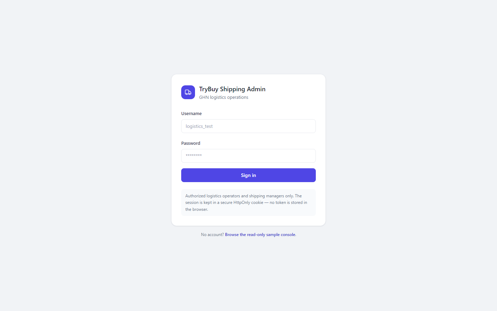
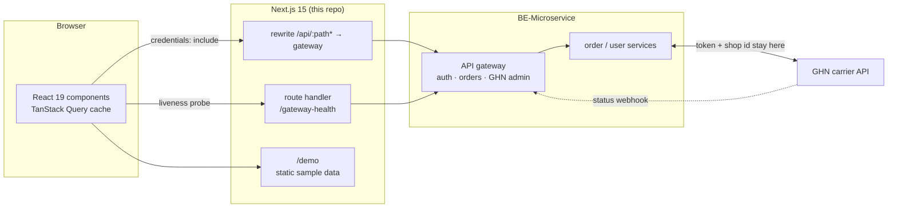

# TryBuy GHN Console

[](https://github.com/quangtruong01234/web-flow-GHN/actions/workflows/ci.yml)
[](https://nextjs.org/)
[](https://react.dev/)
[](https://www.typescriptlang.org/)
[](LICENSE)

An operations console for **GHN** (Giao Hàng Nhanh, a Vietnamese courier) shipments, built
on **Next.js 15 App Router + React 19 + TypeScript**. Logistics staff use it to work a queue
of orders: inspect the local order beside the carrier's waybill, read the full shipping
history, pull the current GHN status on demand, and run the carrier actions the backend
allows — cancel, return, update COD, update receiver details.

It is one of three repositories in the TryBuy project and talks to exactly one of them:

| Repository | Role |
| ---------- | ---- |
| **This repo** | GHN logistics console (Next.js 15, App Router) |
| [BE-Microservice](https://github.com/quangtruong01234/BE-Microservice) | NestJS microservices + API gateway — the only backend this console calls |
| [FE-React-Vite](https://github.com/quangtruong01234/FE-React-Vite) | Customer storefront (React + Vite) |

## Live demo

The gateway runs **14:00–19:00 ICT (UTC+7)** to keep hosting cost near zero. Outside that
window the console detects it, explains it in a banner on every page, and points at a
public, read-only walkthrough that needs no backend and no sign-in:

- **Sample console:** `/demo` — the real components rendered against static sample rows.
- **Demo guide:** [`docs/DEMO.md`](docs/DEMO.md) — accounts, a four-step shipment flow, and
  what to look at while clicking through.

Deployment URLs are set per environment; see [Deployment](#deployment).

## Screenshots

The quickest look at the UI is the `/demo` route above — it renders the dashboard KPI cards,
the shipment grid, and the shipping-history timeline with no backend running.

**The sample console (`/demo`)** — KPI cards that state the window they counted, the
shipment grid with both status systems side by side, and the shipping history of the
selected order:


**Sign-in, and the same page while the gateway is outside its hosting window** — the banner
explains the schedule and links to the sample console instead of failing blank:

| Sign in | Gateway offline |
| ------- | --------------- |
|  |  |

<!-- The authenticated screens (dashboard, shipment detail with carrier actions) need a
     signed-in session against a running gateway; add them here as docs/img/*.png. -->

## Architecture



Two boundaries are load-bearing:

- **The console never calls GHN.** The carrier token, shop id, and webhook secret exist only
  in the backend. Everything shipment-related goes through the gateway's GHN admin routes.
- **GHN status is backend-owned.** The UI renders the status the backend reported and never
  derives one locally — not even for the ten GHN statuses (`delivery_fail`, `exception`,
  `damage`, `lost`, …) the backend deliberately leaves without a local equivalent.

## Key engineering decisions

**Cookie session, never a token in storage.** Login posts to the gateway and the session
arrives as an `HttpOnly` cookie; every request sends `credentials: "include"`. No JWT is
readable from JavaScript, so XSS cannot lift the session.

**401 and 403 are handled differently, on purpose.** A `401` publishes through a small
session-expiry channel, drops the cached user, and redirects to `/login?next=<path>`. A
`403` never does — it is a role or action refusal, and bouncing it to login would loop
between a valid session and a page it may not see.

**Server-filtered permissions, not a client role table.** Carrier actions render from the
`availableActions` array the gateway returns per order, which it filters by both permission
and order state. Duplicating that logic client-side would drift the moment the backend
changed a rule.

**Sync is explicit, one order per click.** The backend notifies the buyer the first time an
order records a failed delivery, and two of the three trigger paths are buttons in this
console. So there is no bulk sync, no auto-sync on mount, and no polling interval over the
sync endpoint — a loop would message real buyers. The UI states this next to the button.

**Irreversible actions confirm first.** Cancel and return cannot be undone at the carrier,
so both pass through a confirm dialog. The reversible waybill edits (COD, receiver) use
plain modals.

**Numbers say what they actually counted.** Dashboard KPI cards count the page that was
fetched, not the whole queue — there is no per-status count endpoint. When the queue is
larger they render `12+` and a banner names the window, rather than letting a partial count
read as a total. Money fields the backend omits are hidden, never rendered as zero.

**The backend being down is a designed state.** A route handler probes the gateway's
`/health` server-side (3s budget); the client half never rejects, so a failed probe surfaces
as "offline" instead of an error boundary. The banner is non-blocking and stays hidden until
the first probe settles, so a slow probe cannot flash a false alarm.

## Getting started

Requires **Node 20–22** (see `.nvmrc`) and npm. The dev server runs on **port 3013**.

```bash
npm install
cp .env.example .env.local   # then edit
npm run dev                  # → http://localhost:3013
```

> On Windows, if PowerShell's execution policy blocks `npm.ps1`, use `npm.cmd` / `npx.cmd`.

### Environment

Every key lives in [`.env.example`](.env.example); `.env*` files are git-ignored and only
the example is tracked. Only `NEXT_PUBLIC_*` values reach the browser.

| Var | Purpose | Browser? |
| --- | ------- | -------- |
| `NEXT_PUBLIC_API_URL` | `/api` to use the built-in proxy (recommended), or an absolute gateway URL for direct mode | yes |
| `API_PROXY_TARGET` | Gateway origin the `/api/*` rewrite forwards to | no |
| `NEXT_PUBLIC_GHN_DEMO_MODE` | Reveals the GHN status picker used to drive a sandbox order end to end. Pairs with the backend's `GHN_DEMO_ENDPOINTS_ENABLED`. Off in production | yes |
| `NEXT_PUBLIC_DEMO_GUIDE_URL` | Demo-guide link in the offline banner; omitted when unset | yes |

The GHN token, shop id, and webhook secret are **backend-only** and must never appear in
this repo — not even behind a non-public name.

Without the backend running you can still browse `http://localhost:3013/demo`.

## Testing

```bash
npm run lint        # next lint
npm run typecheck   # tsc --noEmit
npm test            # Jest — 127 unit tests across 20 suites
npm run e2e         # Playwright — 12 specs, gateway responses mocked
npm run verify      # lint → typecheck → test → build
```

Unit tests cover the adapters, status/formatting helpers, route guards, and each screen's
loading / empty / error / offline states. The Playwright specs mock the gateway, so they
need no backend. A manual QA checklist lives in `.ai/context/testing.md`.

## Deployment

CI runs on GitHub Actions (`.github/workflows/ci.yml`) for every push and PR to `main`:

| Job | What it runs |
| --- | ------------ |
| `verify` | `lint` → `typecheck` → `test` → `build`, sequential |
| `e2e` | Playwright against a self-started dev server; uploads the HTML report |
| `deploy` | Vercel — **only after `verify` and `e2e` pass**. `main` → production, PR → preview URL commented on the PR |

Vercel is the target because `rewrites()`, SSR, and route handlers work with no adapter.
`vercel.json` pins the function region to `sin1` (Singapore) and disables Vercel's own Git
auto-deploy, so the gated workflow is the single deploy path.

**Behaviour when the gateway is offline.** The deployed console does not fail blank. A
server-side probe of the gateway's `/health` drives a banner that names the hosting window
and links to `/demo`, the public sample console. `/demo` is a static page outside the
authenticated route group, so it renders with the backend completely down.

### One-time Vercel setup

Without these secrets CI still runs in full — the `deploy` job just skips.

```bash
npx vercel login
npx vercel link          # creates .vercel/project.json (git-ignored)
```

Then add three GitHub repo secrets (Settings → Secrets and variables → Actions):

| Secret | Where to get it |
| ------ | --------------- |
| `VERCEL_TOKEN` | vercel.com → Account Settings → Tokens — scope **All Projects** |
| `VERCEL_ORG_ID` | `.vercel/project.json` → `orgId` |
| `VERCEL_PROJECT_ID` | `.vercel/project.json` → `projectId` |

> The token scope matters. A token scoped to a single project cannot read the project
> settings `vercel pull` needs, and the deploy job fails with the misleading
> `Could not retrieve Project Settings. To link your Project, remove the '.vercel'
> directory and deploy again` — which points at a local directory that has nothing to do
> with it.

### Deployed environment variables

Set these in the Vercel project (Settings → Environment Variables), **not** in git.

> **All of them must be non-sensitive.** CI builds with `vercel pull` + `vercel build`, and
> a variable marked *Sensitive* downloads as the literal string `[SENSITIVE]`. A sensitive
> `NEXT_PUBLIC_API_URL` gets inlined into the client bundle as `[SENSITIVE]`; a sensitive
> `API_PROXY_TARGET` produces a broken rewrite destination. Recent CLI versions default to
> sensitive, so set them explicitly:
>
> ```bash
> vercel env add API_PROXY_TARGET production --no-sensitive --value "https://gateway.example.com"
> ```
>
> Verify with `vercel pull --environment=preview` and read `.vercel/.env.preview.local`.
> None of these are secrets — `NEXT_PUBLIC_*` ship to the browser anyway, and
> `API_PROXY_TARGET` is just a public hostname.

> **A deployed build needs a publicly reachable gateway.** `API_PROXY_TARGET` defaults to
> `http://localhost:3000`, which does not exist on Vercel. Until the gateway has a public
> URL, the deployed app renders and `/demo` works, but every `/api/*` call fails and the
> offline banner stays up.

## How AI is used in this project

This repository is written with AI coding agents in the loop, and the guidance they follow
is checked in rather than kept in a chat window.

- **`.ai/`** is the canonical, tool-neutral guidance: `project.md` (overview, current state,
  task order, and a Context Map that says which file to read for which kind of task) and
  `.ai/context/*.md` (hard rules, structure, styling, auth, data fetching, conventions,
  domain semantics, testing, flows, known risks).
- **`AGENTS.md`**, **`.claude/`** and **`.agents/`** are thin, tool-specific adapters that
  route a given agent back to `.ai/` — plus the repeatable workflows (a commit routine and
  a weekly backlog sweep). Shared rules are never duplicated into them, which is why
  `AGENTS.md` is under 40 lines.
- **`.ai/context/risks.md`** is a numbered, living list of known gaps. Several comments in
  the source cite it by number, so a reader can trace why a guard exists.
- **`handoff/CHANGELOG.md`** records each backend contract change (its ticket id, the date,
  and what the console had to do about it).

The rules that matter most are the ones that stop an agent from doing something plausible
but wrong: never fabricate a GHN status client-side, never loop over the sync endpoint,
never put a carrier secret behind a `NEXT_PUBLIC_` name. Every change still has to pass
`lint`, `typecheck`, `test`, and `build` before it counts as done.

## Project structure

```
src/
  app/                      App Router routes (thin — they delegate)
    (app)/                  Authenticated group, guarded by AuthGate
      dashboard/ shipments/ sync/ history/ settings/
    demo/                   Public read-only sample console
    gateway-health/         Server-side gateway liveness probe
    login/  403/            Public routes
  components/ui/            Primitives (Button, Card, Icon, Input, Modal, Badge)
  context/                  AuthContext, ToastContext
  features/ghn-shipping/
    api/                    Gateway clients, DTOs, and view-model adapters
    components/             Every console screen and its parts
    hooks/                  TanStack Query hooks
    lib/                    Status, formatting, id, and error helpers
    data/                   Static sample data for /demo
    testing/                Test-only fixtures
  hooks/                    Query keys, gateway-health hook
  lib/                      fetch wrapper, auth API, query client, cn()
e2e/                        Playwright specs
.ai/                        Canonical AI agent guidance
handoff/                    Backend contract changelog and snapshots
```

### The other root entries

GitHub lists dot-directories first, so the repository root opens on folders that are not
the application. What each one is:

| Entry | What it is |
| ----- | ---------- |
| `.ai/` | Canonical agent guidance — see [How AI is used](#how-ai-is-used-in-this-project) |
| `.claude/`, `.agents/`, `AGENTS.md` | Tool adapters pointing at `.ai/`, plus the commit and backlog-sweep workflows. The paths are fixed by the tools, so they cannot be nested elsewhere |
| `handoff/` | Backend contract changelog and the original implementation snapshot |
| `docs/` | The bilingual demo guide |
| `scripts/` | Two Windows PowerShell helpers: restart the dev server on 3013, and run Playwright against a temporary one |
| `TryBuy Shipping Dashboard/` | The Claude Design source the UI was built from — **visual reference only**. `support.js` in it is generated preview runtime and is never imported or executed by the app |

One note on dependencies: `zustand` is installed but currently unused. Server state lives in
TanStack Query and the little client state there is fits in `useState` or context, so no
store has been justified yet.

## License

[MIT](LICENSE) © 2026 Quang Truong
