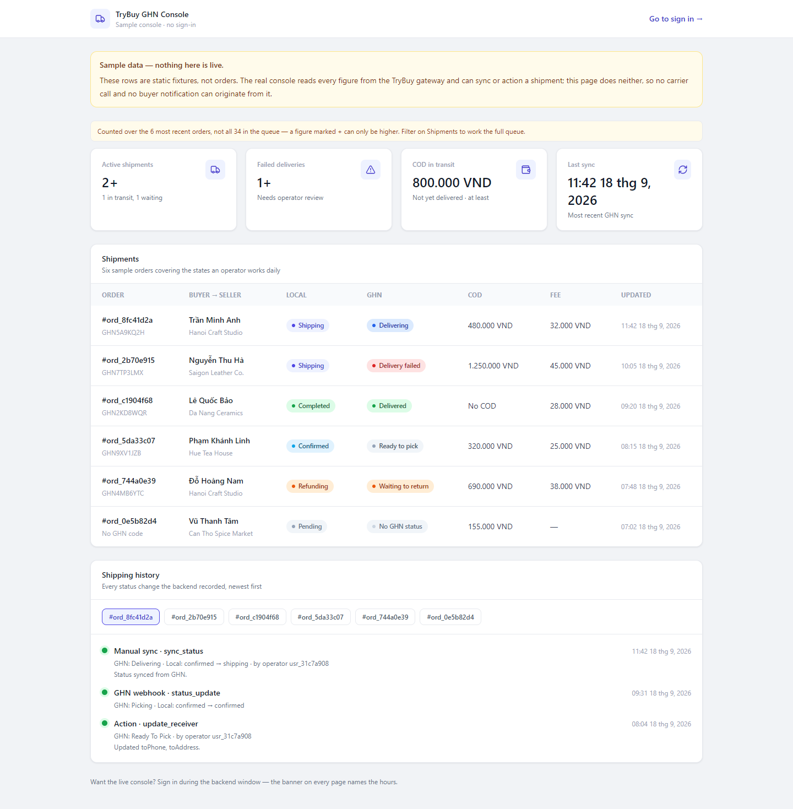
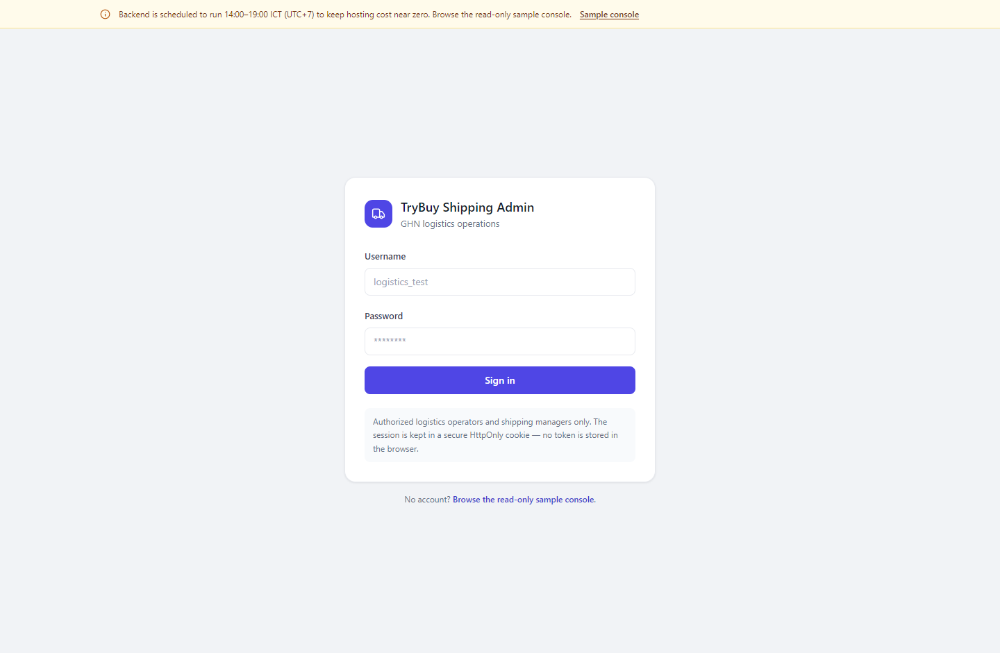

# Demo guide — TryBuy GHN Console

English first, Vietnamese below. / Tiếng Anh trước, tiếng Việt bên dưới.

This guide covers the **logistics console** only. The end-to-end buyer and seller flows live
in the backend repository's demo guide:
[BE-Microservice](https://github.com/quangtruong01234/BE-Microservice).

---

## Links and schedule

| | |
| --- | --- |
| **Console** | the deployed URL for this repo |
| **Storefront** | [FE-React-Vite](https://github.com/quangtruong01234/FE-React-Vite) |
| **Backend hours** | **14:00–19:00 ICT (UTC+7)** — the gateway is off outside this window to keep hosting cost near zero |
| **Outside those hours** | open `/demo` on the console: a read-only sample screen that needs no backend and no sign-in. A banner on every page says the same thing and links there. |

## Accounts

Passwords are shared separately and are never committed to this repository.

| Username | Role | What it shows |
| --- | --- | --- |
| `logistics_test` | `logistics_operator` | Read-only operator view. The gateway returns `["read", "history"]` for this role, so no carrier action button renders at all — the UI does not grey them out, it never receives them. |
| `shipmgr_test` | `shipping_manager` | Full console: sync, cancel, return, update COD, update receiver — each one only when the order's state allows it. |
| `testadmin` | `admin` | Legacy compatibility account. It is **not** a GHN console role and is bounced to `/403`. Useful for demonstrating the role guard. |

## Flow: working a shipment

Four steps, run as `shipmgr_test` during the backend window.

1. **Sign in and open the dashboard.** KPI cards summarise the fetched page of orders. If
   the queue is larger than the page, the numbers render as `12+` with a banner naming the
   window — the backend has no per-status count endpoint, so a total would be a guess.
2. **Open a shipment.** `/shipments` → click an order id. The detail page puts the local
   TryBuy order beside the GHN waybill: receiver, COD, fees, expected delivery, and the
   full shipping history as a timeline.
3. **Sync the GHN status.** Press **Sync status**. The backend calls GHN, records the
   result, and returns the new state; the timeline gains a row. Note the line beside the
   button: sync is one order per click on purpose — the backend notifies the buyer the
   first time an order records a failed delivery, so a bulk or automatic sync would
   message real people.
4. **Update COD.** Press **Update COD**, enter a new amount, confirm. The waybill edit goes
   through the gateway to GHN and the result is written to the history. Cancel and return
   are also available, both behind a confirm dialog because neither can be undone at the
   carrier.

### What it looks like without the backend

The sample console at `/demo`, and the sign-in screen with the offline banner:

<!-- Screens that need a signed-in session (dashboard, shipment detail with the carrier
     action panel) are not captured here; add them to docs/img/ when convenient. -->

## What to look at

- **The console never talks to GHN.** Open DevTools → Network while syncing. Every request
  goes to this app's own origin under `/api/*`, which the server forwards to the gateway.
  The carrier token and shop id exist only in the backend.
- **Permissions come from the server, per order.** The action buttons are rendered from the
  `availableActions` array the gateway returns, filtered by both role and order state. Sign
  in as `logistics_test` and the same order shows no action buttons.
- **Opaque ids in the URL.** `/shipments/ord_8fc41d2a` — no incrementing integer to walk.
  The same holds for user and product references in the payloads.
- **A GHN status without a local one.** An order at `delivery_fail` keeps its local status:
  GHN retries before moving a parcel to the return family, and cancelling on the first miss
  would release stock for a parcel still out for delivery. The history row records the GHN
  status; the local status column does not move.
- **403 does not log you out.** Sign in as `testadmin`: you land on `/403`, still
  authenticated. A `401` (expired cookie) is what returns you to `/login`, carrying the
  page you were on.
- **Offline is a designed state.** Stop the gateway, reload: the banner appears within a few
  seconds and `/demo` still renders.

---

# Hướng dẫn demo — TryBuy GHN Console (Tiếng Việt)

Tài liệu này chỉ nói về **console vận hành logistics**. Luồng mua hàng và bán hàng đầy đủ
nằm ở demo guide của repo backend:
[BE-Microservice](https://github.com/quangtruong01234/BE-Microservice).

## Link và lịch chạy

| | |
| --- | --- |
| **Console** | URL đã deploy của repo này |
| **Storefront** | [FE-React-Vite](https://github.com/quangtruong01234/FE-React-Vite) |
| **Giờ backend** | **14:00–19:00 ICT (UTC+7)** — ngoài khung giờ này gateway tắt để giữ chi phí hosting gần bằng 0 |
| **Ngoài giờ đó** | mở `/demo` trên console: màn hình mẫu chỉ đọc, không cần backend, không cần đăng nhập. Banner trên mọi trang cũng nói điều này và dẫn tới đó. |

## Tài khoản

Mật khẩu được gửi riêng, không bao giờ commit vào repo này.

| Username | Role | Thấy được gì |
| --- | --- | --- |
| `logistics_test` | `logistics_operator` | Chế độ chỉ đọc. Gateway trả về `["read", "history"]` cho role này nên không nút hành động nào được render — giao diện không làm mờ nút, mà đơn giản là không nhận được chúng. |
| `shipmgr_test` | `shipping_manager` | Console đầy đủ: sync, huỷ, hoàn hàng, đổi COD, đổi người nhận — mỗi thứ chỉ hiện khi trạng thái đơn cho phép. |
| `testadmin` | `admin` | Tài khoản tương thích cũ. Đây **không** phải role của console GHN nên sẽ bị đẩy sang `/403`. Dùng để minh hoạ route guard. |

## Luồng: xử lý một đơn vận chuyển

Bốn bước, chạy bằng `shipmgr_test` trong khung giờ backend.

1. **Đăng nhập và mở dashboard.** Các thẻ KPI tổng hợp trang đơn vừa tải. Nếu hàng đợi lớn
   hơn một trang, số hiển thị dạng `12+` kèm banner nói rõ phạm vi đếm — backend không có
   endpoint đếm theo trạng thái, nên một con số "tổng" sẽ là phỏng đoán.
2. **Mở một đơn.** `/shipments` → bấm vào mã đơn. Trang chi tiết đặt đơn TryBuy cạnh vận
   đơn GHN: người nhận, COD, phí, thời gian giao dự kiến, và toàn bộ lịch sử vận chuyển
   dạng timeline.
3. **Sync trạng thái GHN.** Bấm **Sync status**. Backend gọi GHN, ghi lại kết quả và trả về
   trạng thái mới; timeline có thêm một dòng. Chú ý dòng chữ cạnh nút: sync cố ý chỉ chạy
   cho một đơn mỗi lần bấm — backend gửi thông báo cho người mua ở lần đầu đơn ghi nhận
   giao thất bại, nên sync hàng loạt hoặc tự động sẽ nhắn tin cho người thật.
4. **Cập nhật COD.** Bấm **Update COD**, nhập số tiền mới, xác nhận. Lệnh sửa vận đơn đi qua
   gateway tới GHN và kết quả được ghi vào lịch sử. Huỷ và hoàn hàng cũng có sẵn, cả hai đều
   qua hộp thoại xác nhận vì không thể hoàn tác ở phía nhà vận chuyển.

## Nên chú ý điều gì

- **Console không bao giờ gọi thẳng GHN.** Mở DevTools → Network khi sync. Mọi request đều
  đi tới chính origin của app dưới `/api/*`, phía server mới chuyển tiếp sang gateway. Token
  và shop id của GHN chỉ tồn tại ở backend.
- **Quyền đến từ server, theo từng đơn.** Nút hành động được render từ mảng
  `availableActions` do gateway trả về, đã lọc theo cả role lẫn trạng thái đơn. Đăng nhập
  bằng `logistics_test` thì cùng đơn đó không có nút nào.
- **ID mờ trên URL.** `/shipments/ord_8fc41d2a` — không có số tăng dần để dò. Tham chiếu
  người dùng và sản phẩm trong payload cũng vậy.
- **Trạng thái GHN không có trạng thái local tương ứng.** Đơn ở `delivery_fail` vẫn giữ
  nguyên trạng thái local: GHN sẽ giao lại trước khi chuyển sang nhóm hoàn hàng, và huỷ ngay
  lần giao hụt đầu tiên sẽ nhả tồn kho cho một kiện vẫn đang trên đường. Dòng lịch sử ghi
  nhận trạng thái GHN; cột trạng thái local không đổi.
- **403 không đăng xuất bạn.** Đăng nhập bằng `testadmin`: bạn tới `/403` nhưng vẫn đang
  đăng nhập. Chỉ `401` (cookie hết hạn) mới đưa bạn về `/login`, mang theo trang đang xem.
- **Offline là một trạng thái đã thiết kế.** Tắt gateway rồi tải lại: banner hiện sau vài
  giây và `/demo` vẫn chạy.

### Trông như thế nào khi không có backend

Console mẫu ở `/demo`, và màn hình đăng nhập kèm banner offline:

